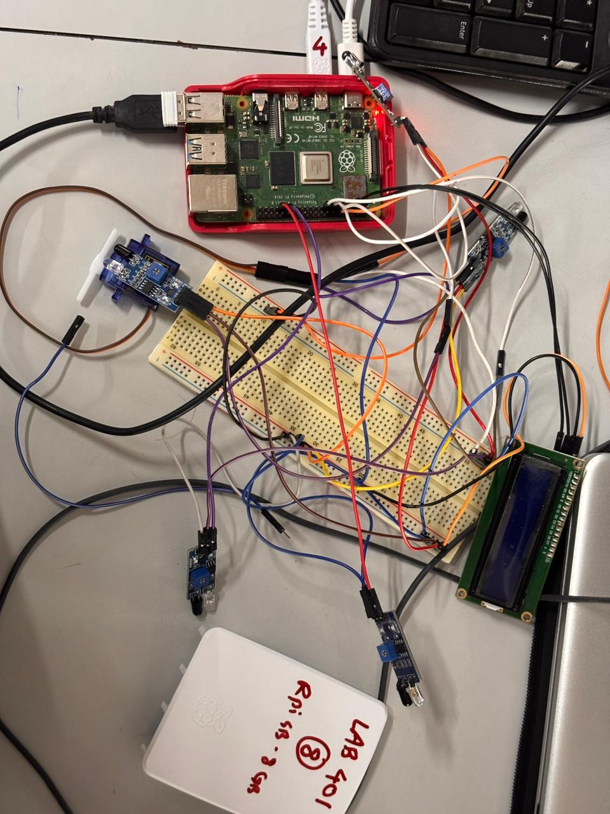
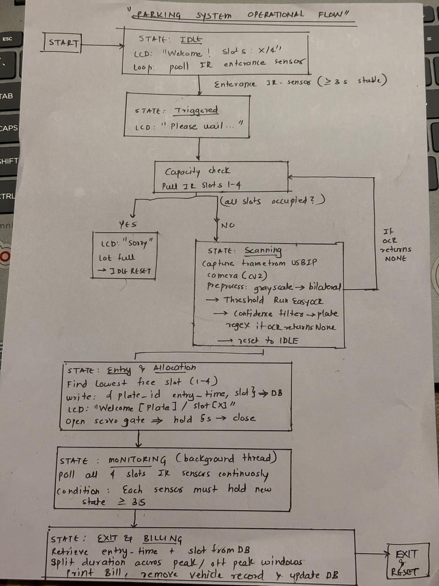
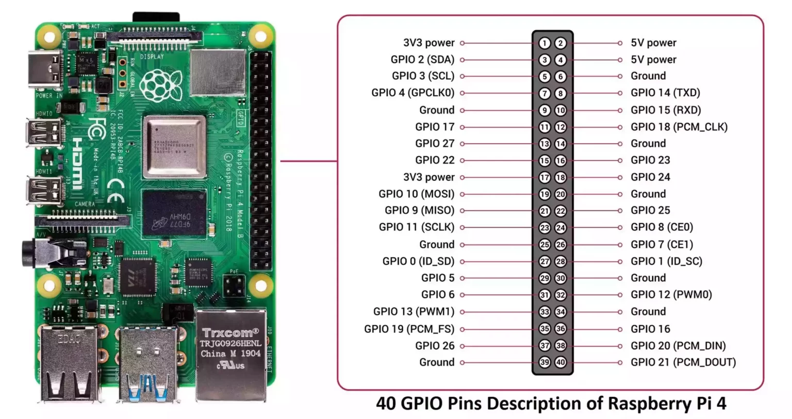
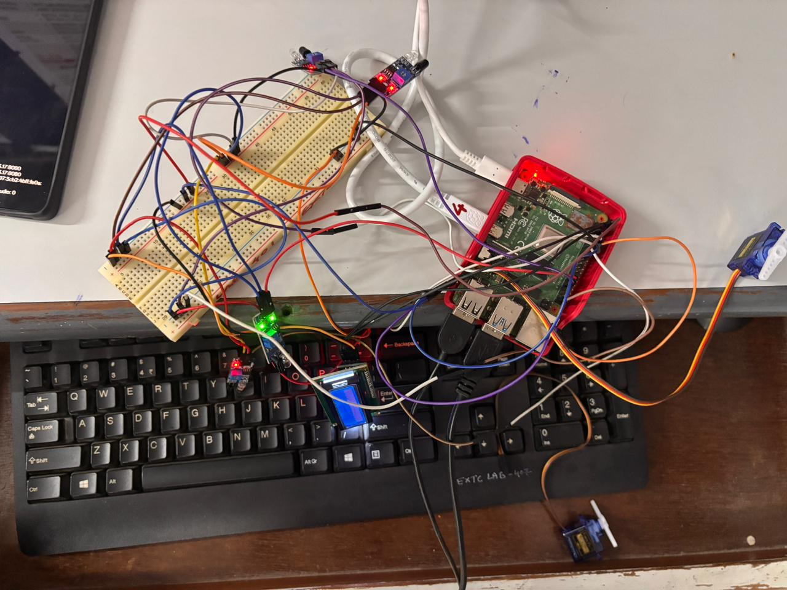
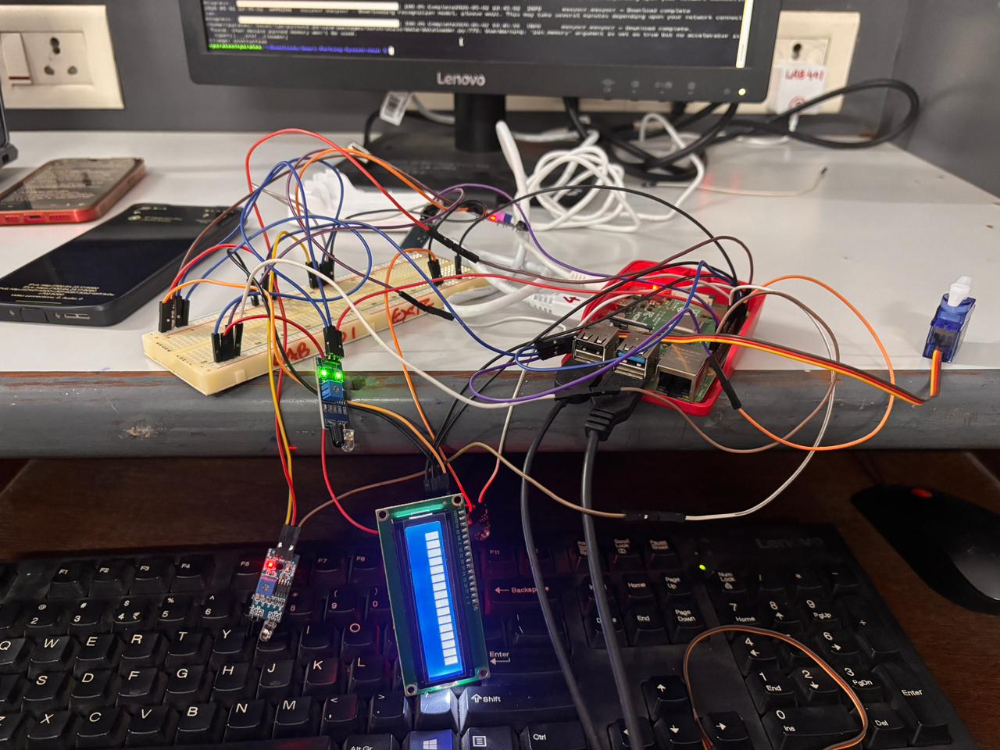

# SKILL LAB PRACTICAL HACKATHON

## Final Project README

---

# 1. Team Identity

## 1.1 Studio / Group Name
`RPIrates`

## 1.2 Team Members
| Name | Primary Role | Secondary Role | Strengths |
| --- | --- | --- | --- |
| Ashutosh Awasthi |Github repo maintainer |Coding  |software and documentation |
| Shams Kadri |Hardware design and integration |Ideation and Logic |Hardware and backend |
| Chirag Pedeamkar |Research papers,documentaion |hardware integration | Presentation of project |
| Sanisa Patrikar |Logic design and implementation |Team coordination |software and presentation |

## 1.3 Project Title
`Smart Parking System`

## 1.4 One-Line Pitch
A modular, Raspberry Pi 4B–based Smart Parking System automating vehicle entry, slot allocation, and dynamic billing for a mall environment.

## 1.5 Expanded Project Idea
The project automates the complete vehicle lifecycle inside a mall car park. It uses an IR sensor at the entrance to detect approaching vehicles, triggering an ALPR (Automatic Licence Plate Recognition) pipeline via OpenCV and EasyOCR. The system finds the lowest-numbered free parking slot, logs the entry time to a local JSON database, displays directions on an I2C LCD, and opens a servo-controlled gate.

Occupancy is tracked continuously using debounced IR sensors at each slot. When a vehicle leaves, the system automatically detects the exit, calculates the parking duration, and generates an itemized bill using dynamic pricing (peak vs. off-peak rates), all executed locally on the Raspberry Pi.

---

# 2. Inspiration

## 2.1 References
| Source Type | Title / Link | What Inspired the Project |
| --- | --- | --- |
| Paper | Smart_Parking_System_using_IoT_Technology.pdf (under docs/) | IoT-based approach to automating parking slots and improving user experience. |
| Codebase | OpenCV / EasyOCR Documentation | ALPR implementation for licence plate scanning. |

## 2.2 Original Twist
Dynamic Pricing Engine: Instead of a flat fee or cloud-dependent billing, the system calculates costs using a local dynamic pricing model. It charges Rs. 50/hour during off-peak and Rs. 75/hour during peak hours (17:00–22:00), splitting the duration across windows automatically.

---

# 3. Project Intent

## 3.1 User Journey
1. A driver approaches the mall parking entrance.
2. The Entrance IR sensor detects the vehicle.
3. The LCD displays "Please wait..." and "Scanning plate".
4. The camera scans the licence plate and extracts the text.
5. The system allocates a free slot (e.g., Slot 2), saves it to the database, and displays "Hi [Plate] / Go to Slot 2" on the LCD.
6. The servo gate opens for 5 seconds to let the car in.
7. The driver parks in the allocated slot.
8. When leaving, the slot IR sensor transitions from Occupied to Free.
9. The system calculates the fee based on the duration and dynamic pricing, prints an itemized receipt to the terminal, and clears the slot.

---

# 4. Definition of Success

## 4.1 Definition of “Usable”
The system accurately detects a vehicle, extracts the licence plate text, successfully allocates an open slot, actuates the entry gate, and accurately tracks the exit to output a correct time-based bill.

## 4.2 Minimum Usable Version
Working ALPR, slot tracking with IR sensors, gate control via servo, and basic flat-rate billing upon exit.

## 4.3 Stretch Features
- Dynamic peak/off-peak pricing.
- 16x2 I2C LCD for real-time user instructions.
- Software-debounced IR sensors for accurate state tracking.
- Local JSON database management (`database.json`).

---

# 5. System Overview

## 5.1 Project Type
- [x] Electronics-based
- [ ] Mechanical
- [x] Sensor-based
- [ ] App-connected
- [x] Motorized
- [ ] Sound-based
- [ ] Light-based
- [x] Screen/UI-based
- [x] Fabricated structure
- [x] Game logic based (State Machine logic)
- [ ] Installation
- [ ] Other

## 5.2 High-Level System Description
A Raspberry Pi 4B acts as the central controller, coordinating an EasyOCR-based vision pipeline, hardware PWM for a servo gate, an I2C LCD, and five debounced IR sensors for entrance and capacity management. A state machine (`main.py`) manages the operational flow from Idle to Triggered, Scanning, Allocation, Monitoring, and Billing.

## 5.3 Input / Output Map
| System Part | Type | What It Does |
| --- | --- | --- |
| Entrance IR Sensor | Input | Detects approaching vehicle at the gate. |
| Webcam / IP Cam | Input | Captures the frame for licence plate recognition. |
| Slot IR Sensors (x4) | Input | Tracks occupancy of the parking slots. |
| Servo Motor | Output | Opens and closes the entrance gate. |
| 16x2 I2C LCD | Output | Displays instructions and slot allocation to the user. |
| Terminal / Console | Output | Prints the final itemized billing receipt. |

---

# 6. System Design, Sketches and Visual Planning

## 6.1 Concept Architecture/sketch/schematic

## 6.2 Labeled Build Sketch/architecture/flow diagram/algorithm

 

## 6.3 Approximate Dimensions
| Dimension | Value |
| --- | --- |
| Length | 30 cm |
| Width | 20 cm |
| Height | 15 cm |
| Estimated weight | 800 g |

---

# 7. Electronics Planning

## 7.1 Electronics Used
| Component | Quantity | Purpose |
| --- | ---: | --- |
| Raspberry Pi 4B (2 GB+) | 1 | Main controller and OCR processing |
| 16×2 I2C LCD Display | 1 | User-facing status messages |
| Servo Motor (SG90) | 1 | Automated entrance gate |
| IR Proximity Sensor | 5 | 1× entrance trigger + 4× slot occupancy |
| USB Webcam / IP Camera | 1 | Licence plate capture |
| Breadboard + Jumper Wires | 1 | Prototyping connections |
| 5V / 3A USB-C Power | 1 | Powers the Pi |

## 7.2 Wiring Plan
- **I2C LCD**: SDA to GPIO 2, SCL to GPIO 3. Powered by **5V rail**.
- **Servo Motor**: PWM to GPIO 18 (via RPi.GPIO). Powered by **5V rail**.
- **IR Sensors**: Entrance (GPIO 17), Slots 1-4 (GPIO 27, 22, 5, 6). Powered EXCLUSIVELY by the **3.3V rail**.

## 7.3 Circuit Diagram/architecture diagram

## 7.4. Power Plan
| Question | Response |
| --- | --- |
| Power source | 5V / 3A USB-C for Raspberry Pi |
| Voltage required | 3.3V for IR logic, 5V for LCD and Servo |
| Current concerns | Servo motor load can cause voltage drop and Pi brownout. Optional external 5V supply for servo. |
| Safety concerns | **CRITICAL:** IR Sensors must be powered from 3.3V. Providing 5V to IR sensors will output 5V to GPIO and destroy the Pi. |

---

# 8. Software Planning/

## 8.1 Software Tools
| Tool / Platform | Purpose |
| --- | --- |
| Python 3.9+ | Main application logic and state machine |
| OpenCV + EasyOCR | Image capture, pre-processing, and licence plate text extraction |
| RPi.GPIO | Software PWM generation for servo control |
| RPLCD | Managing the I2C 16x2 LCD display |

## 8.2 Software Logic/Algorithm
- Initialize GPIO pins, PWM channels, and I2C LCD interface.
- Poll entrance IR sensor (debounced).
- On trigger, check capacity using slot IR sensors.
- If space is available, capture frame and run OpenCV/EasyOCR ALPR.
- Find the lowest free slot (1-4).
- Write `{plate_id, entry_time, slot}` to `database.json`.
- Display assigned slot on LCD and open servo gate for 5 seconds.
- Background thread monitors slot IR sensors continuously.
- On Occupied -> Free transition, calculate parking duration.
- Split duration across peak/off-peak windows, print itemized bill, and remove record from database.

## 8.3 Code Flowchart

---

# 9. Bill of Materials

## 9.1 Full BOM
| Item | Quantity | In Kit? | Need to Buy? | Estimated Cost | Material / Spec | Why This Choice? |
| --- | ---: | --- | --- | ---: | --- | --- |
| Raspberry Pi 4B | 1 | No | Yes | 4500 | 2GB+ RAM | Needed for running EasyOCR locally |
| IR Sensor Module | 5 | Yes | No | 300 | Digital OUT | Reliable 3.3V operation |
| Servo Motor SG90 | 1 | Yes | No | 150 | Standard | Simple gate actuation |
| 16x2 I2C LCD | 1 | Yes | No | 250 | I2C Backpack | Uses only 2 GPIO pins |
| USB Webcam | 1 | No | Yes | 800 | 720p minimum | Image capture for ALPR |

## 9.2 Material Justification
The Raspberry Pi 4B is essential for the computational load of PyTorch/EasyOCR. IR sensors were chosen over HC-SR04 ultrasonic sensors for reliability, simplicity, and direct 3.3V compatibility without needing voltage dividers.

## 9.3 Items You chose
| Item | Why Needed | Purchase Link | Latest Safe Date to Procure | Status |
| --- | --- | --- | --- | --- |
| Raspberry Pi 4B | Main compute | Local Store | | Procured |
| Webcam | OCR input | Local Store | | Procured |

## 9.4 Budget Summary
| Budget Item | Estimated Cost |
| --- | ---: |
| Electronics | 6000 |
| Mechanical parts | 200 |
| Fabrication materials | 0 |
| Purchased extras | 0 |
| Contingency | 300 |
| **Total** | **6500** |

## 9.5 Budget Reflection
The highest cost is the Raspberry Pi, which is necessary for edge AI (EasyOCR). The rest of the components are inexpensive standard electronics.

---

# 10. Planning the Work

## 10.1 Team Working Agreement
We will split the work evenly between hardware assembly and software logic/integration. We will commit code frequently and ensure the Raspberry Pi environment is correctly set up with all dependencies.

## 10.2 Task Breakdown
| Task ID | Task | Owner | Estimated Hours | Deadline | Dependency | Status |
| --- | --- | --- | ---: | --- | --- | --- |
| 1 | Hardware Wiring & LCD setup | Chirag | 2 | | | Done |
| 2 | OpenCV & EasyOCR Pipeline | Ashutosh | 4 | | | Done |
| 3 | State Machine & Main Logic | Shams | 3 | | Task 2 | Done |
| 4 | Dynamic Billing Module | Sanisa | 2 | | | Done |
| 5 | Integration & Testing | All | 3 | | Tasks 1,3,4 | Done |

## 10.3 Responsibility Split
| Area | Main Owner | Support Owner |
| --- | --- | --- |
| Vision / OCR | Ashutosh | Shams |
| Core State Machine | Shams | Ashutosh |
| Hardware & Wiring | Chirag | Sanisa |
| Billing & DB | Sanisa | Chirag |

---

# 11 hour Milestones

## 11.1 8-hour Plan(tentetively you may set)

### Bi Hour 1 — Plan and De-risk
- [x] Idea finalized
- [x] Core interaction decided
- [x] Sketches made
- [x] BOM completed
- [x] Purchase needs identified
- [x] Key uncertainty identified
- [x] Basic feasibility tested

### Bi Hour 2 — Build Subsystems
- [x] Electronics tests completed
- [x] CAD / structure planning completed
- [x] App UI started if needed
- [x] Mechanical concept tested
- [x] Main subsystems partially working

### Bi Hour 3 — Integrate
- [x] Physical body built
- [x] Electronics integrated
- [x] Code connected to hardware
- [x] App connected if required
- [x] First playable version exists

### Bi Hour 4 — Refine and Finish
- [x] Technical bugs reduced
- [x] Playtesting completed
- [x] Improvements made
- [x] Documentation completed
- [x] Final build ready

---

# 12. Update Log

## 12.2 Update Log
| Days | Planned Goal | What Actually Happened | What Changed | Next Steps |
| --- | --- | --- | --- | --- |
| Day 1 | Setup Pi, run test OCR | Successfully recognized plates | Removed ultrasonic sensors | Integrate state machine |
| Day 2 | Connect IR sensors & Gate | Wired successfully, implemented 3-sec debounce | Shifted entirely to IR | Build billing logic |
| Day 3 | Write dynamic billing | Completed `billing.py` | Added peak/off-peak pricing | Full system test |
| Day 4 | Final integration & Bug fixing | Fixed I2C LCD addresses and OCR confidence | - | Demo |

---

# 13. Risks and Unknowns

## 13.1 Risk Register
| Risk | Type | Likelihood | Impact | Mitigation Plan | Owner |
| --- | --- | --- | --- | --- | --- |
| EasyOCR slow processing | Technical | High | Medium | Use OpenCV preprocessing to enhance image quality and reduce OCR region | Ashutosh |
| Pi Brownout from Servo | Hardware | Medium | High | Use separate 5V supply if issues arise during testing | Chirag |
| IR Sensor Noise | Hardware | High | Medium | Implemented software debounce (3 seconds) in `hardware.py` | Shams |

## 13.2 Biggest Unknown Right Now
Lighting conditions in the final display area might affect camera capture and OCR accuracy.

---

# 14. Testing

## 14.1 Technical Testing Plan
| What Needs Testing | How You Will Test It | Success Condition |
| --- | --- | --- |
| OCR Accuracy | Present various physical plates to camera | Extracts text correctly >80% of the time |
| IR Debounce | Waving hand quickly in front of IR | Does not trigger until obstructed for >= 3 seconds |
| Billing Calculation | Run `billing_test.py` across peak windows | Receipt matches expected mathematical calculation |

## 14.2 Testing and Debugging Log
| Date | Problem Found | Type | What You Tried | Result | Next Action |
| --- | --- | --- | --- | --- | --- |
| Day 2 | Ultrasonic sensors jittery | Hardware | Switched to digital IR sensors | Perfect stability | Proceed with IR |
| Day 3 | LCD showing garbage | Software | Fixed string padding logic in `hardware.py` | Display clears properly | None |

## 14.3 Playtesting Notes
| Tester | What They Did | What Confused Them | What They Enjoyed | What You Will Change |
| --- | --- | --- | --- | --- |
| Demo User | Parked car | Unsure when to drive in | Loved the automated receipt | Added clear LCD prompts |

---

# 15. Build Documentation

## 15.1 Fabrication Process(if any)
1. Set up the Raspberry Pi 4B with Raspberry Pi OS.
2. Wired the breadboard to distribute a shared Ground, a 5V rail (for LCD and Servo), and a 3.3V rail (for all IR sensors).
3. Connected the 5 IR sensors securely, ensuring none were powered by 5V to protect the Pi's GPIO pins.
4. Set up the webcam facing the entrance pathway.

---

# 16 Build Photos

---

# 17. Final Outcome

## 17.1 Final Description
A fully automated, edge-AI powered Smart Parking System for a mall. The system independently manages entry, assigns slots via visual recognition, tracks occupancy, and handles complex time-based dynamic billing.

## 17.2 What Works Well
- The IR sensor debouncing is extremely robust.
- The dynamic billing seamlessly handles crossing peak and off-peak boundaries.
- The servo gate actuates reliably to control vehicle entry.

## 17.3 What Still Needs Improvement
- EasyOCR processing takes a few seconds on the Pi CPU, which causes a slight wait at the entrance.
- Performance could be improved by using a Coral Edge TPU or lighter OCR model.

## 17.4 What Changed From the Original Plan
We completely dropped HC-SR04 ultrasonic sensors in favor of IR proximity sensors. We also decided to keep all billing logic local instead of sending it to a cloud server to ensure zero latency and offline capability. Additionally, we switched from `pigpio` to `RPi.GPIO` for servo control because the `pigpiod` daemon was causing issues.

---

# 18. Reflection

## 18.1 Team Reflection
We successfully collaborated by splitting the hardware and software tasks efficiently. Merging the computer vision with physical hardware control was a great learning experience.

## 18.2 Technical Reflection
We learned that handling hardware inputs requires robust software techniques, such as debouncing. Also, we learned the importance of understanding GPIO voltage limits (3.3V vs 5V) before wiring.

## 18.3 Design Reflection
The system flow is highly intuitive for the user. Relying on an LCD display provides immediate, clear instructions at the gate.

## 18.4 If You Had One More hour
We would add a web dashboard to visually represent the `database.json` live state, showing which car is in which slot.

---

# 19. Final Submission Checklist

- [x] Team details are complete
- [x] Project description is complete
- [x] Inspiration sources are included
- [x] Sketches are added
- [x] BOM is complete
- [x] Purchase list is complete
- [x] Budget summary is complete
- [x] Mechanical planning is documented if applicable
- [x] App planning is documented if applicable
- [x] Code flowchart is added
- [x] Task breakdown is complete
- [x] Weekly logs are updated
- [x] Risk register is complete
- [x] Testing log is updated
- [x] Playtesting notes are included
- [x] Build photos are included
- [x] Final reflection is written
Build photos are included
- [x] Final reflection is written
